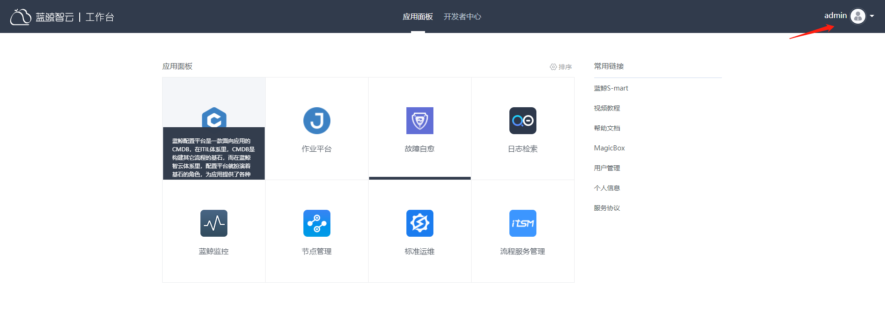
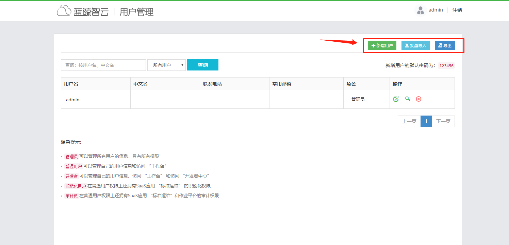
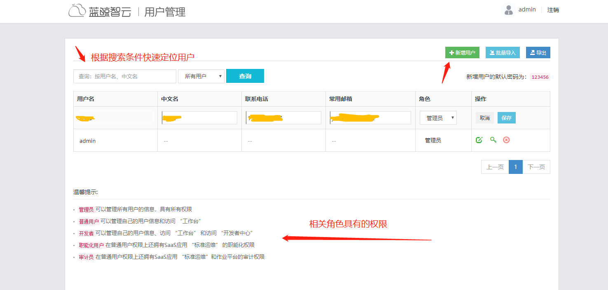
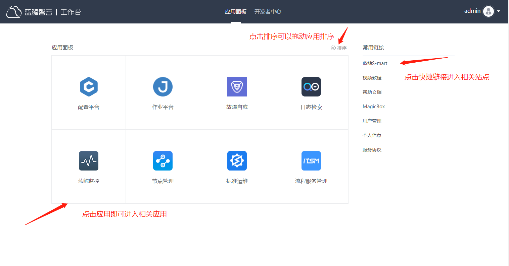
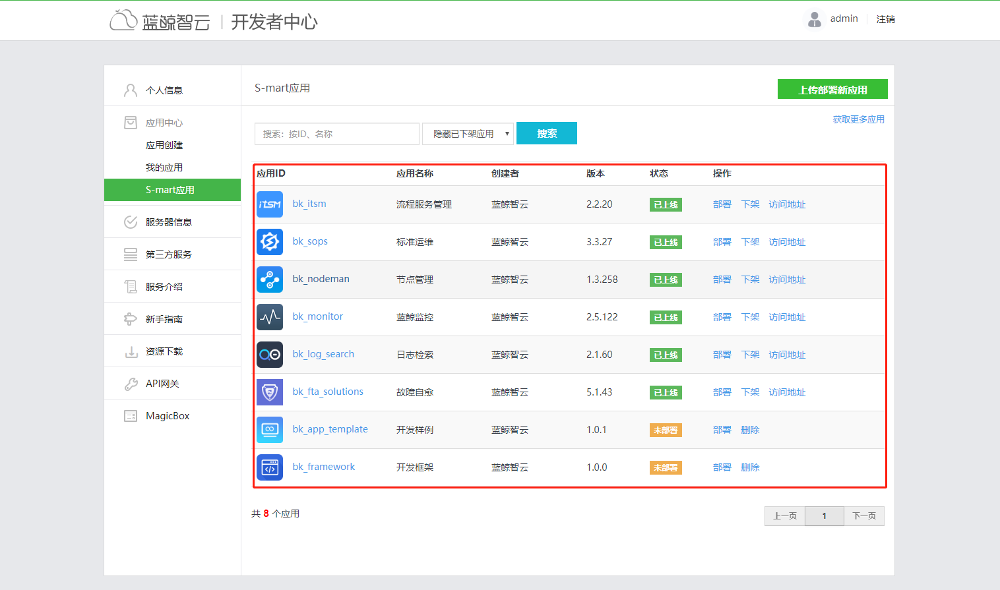

## 蓝鲸工作台介绍

##### 【用户管理】

我们可以在这里进行用户管理，点击admin-->用户管理

新增用户可以新增单个用户，批量导入可以导入多个用户（点击批量导入-->下载EXCEL就可以下载填写表格了，填写完导入进来即可，导出可以把当前用户导入以EXCEL形式保存）。

admin默认管理员，具有最高权限。点击新增用户进行编辑，填写资料，角色选择管理员。(真实环境根据情况来给)
点击右上角注销-->登陆即可完成创建用户操作。
点击左上角蓝鲸智云或者工作台即可回到工作台。

##### 【应用面板】

##### 【开发者中心】

点击应用面板右边的开发者中心即可进入

**创建应用**

* 我的应用

点击开发者中心-->应用创建-->填写资料-->创建应用就能看到创建应用的详细信息，git地址上线代码之后点击发布部署-->一键部署既可以上线代码到测试环境，通过点击我的应用-->应用id名字-->访问地址栏目-->测试地址，访问该地址即可。正式环境的部署在测试环境部署之后可以进行一键部署，和测试环境一样。

* S-mart应用

点击开发者中心-->S-mart应用,若在中控机行执行成功./bkcec install saas-o，那么能够直接看到如图相关应用：

点击部署即可部署，在工作台可以见到该应用。点击下架后将会在工作台无法看到此应用，可以点击搜索栏后面的显示已下架应用，看到该应用，点击重新部署即可上架。还可以点击右上角第二行【获取更多应用】进入官网下载应用，保存到桌面后， 回到开发者中心-->S-mart应用-->上传部署新应用-->选择文件-->找到该文件双击即可完成部署
