## 蓝鲸cmdb平台使用
各个功能介绍请关注官方文档 https://bk.tencent.com/docs/document/5.1/9/222

##### 创建业务

点击:基础资源-->业务-->新建-->填写信息-->保存

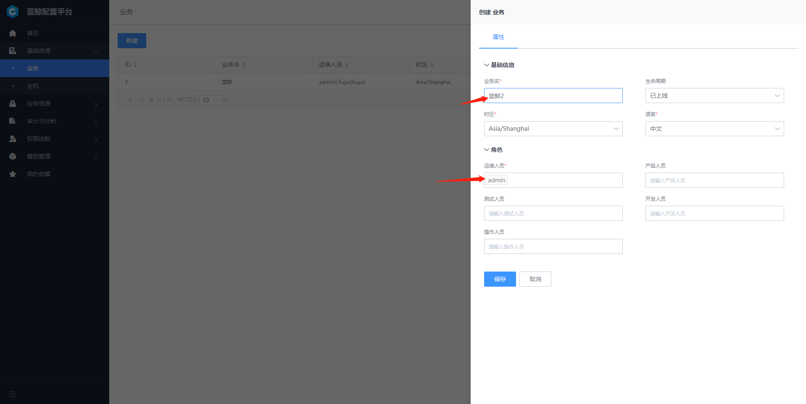

 **注意事项**

创建业务运维人员账号（必填），才能看到相关业务，否则关联其他平台将无法看到和选择创建的此业务，即使是admin也没用，只有该业务运维人员才能看到该业务，我们将运维人员填admin。

点击：业务资源-->业务主机，我们能看到有三台主机，是蓝鲸业务的主机，该三台主机不能动，否则将导致蓝鲸平台出问题。

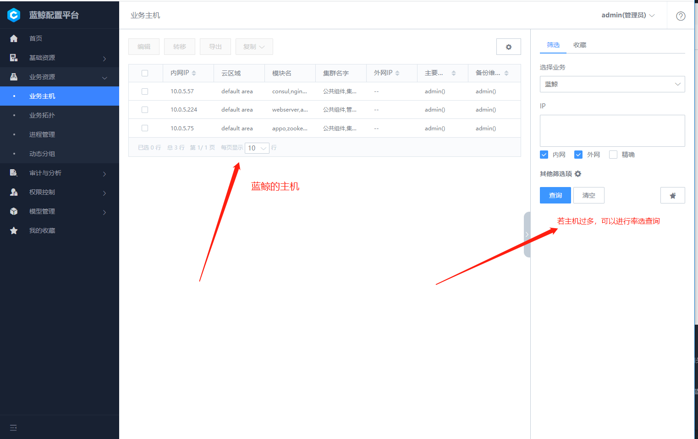

点击：业务资源-->业务拓扑-->选择蓝鲸2，我们可以看到这是我们自己创建的业务，但是目前还没有主机，也没有业务下的具体划分，我们来做如下操作：

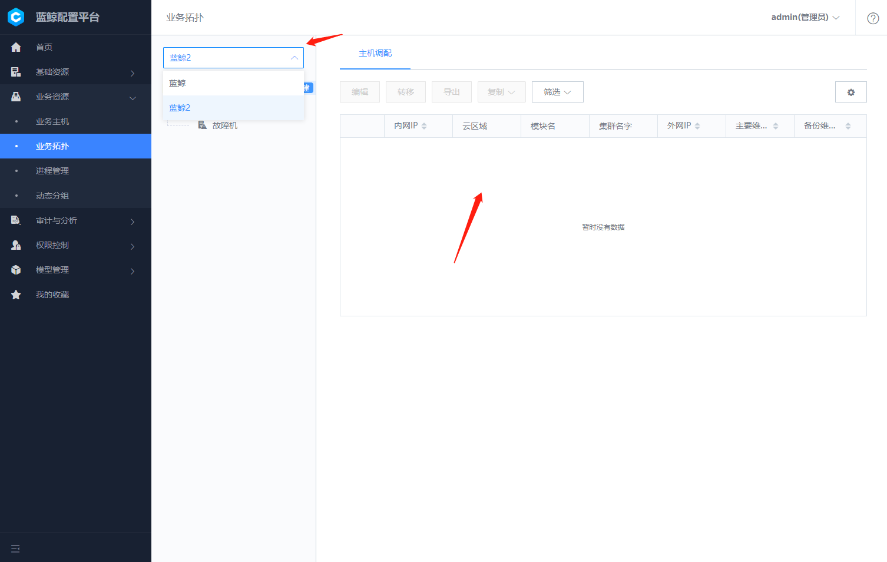

点击蓝鲸2后面的新建-->集群名字填蓝鲸组件-->保存；

点击蓝鲸组件后面的新建-->名字填nginx-->保存，重复此步骤在新建一个mysql出来，此时我们就已经建立了一个业务结构；

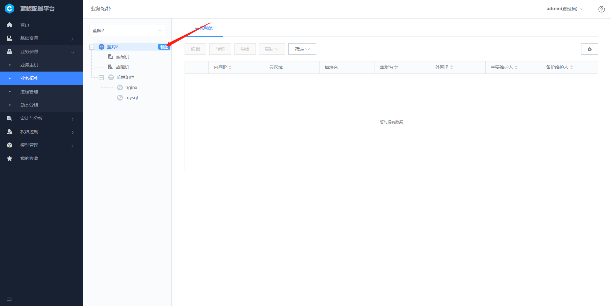
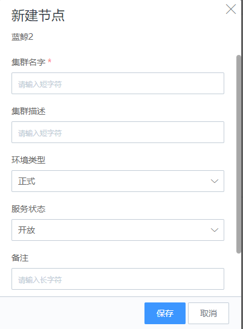

但是此时还没有分配主机，我们可以导入主机，点击基础资源-->主机-->导入主机--下载模板；此时我们假设有3台服务器，每个服务器一个192.168.4网段的内网ip；相互直接能ping通；(填写自己能PING通的主机IP)

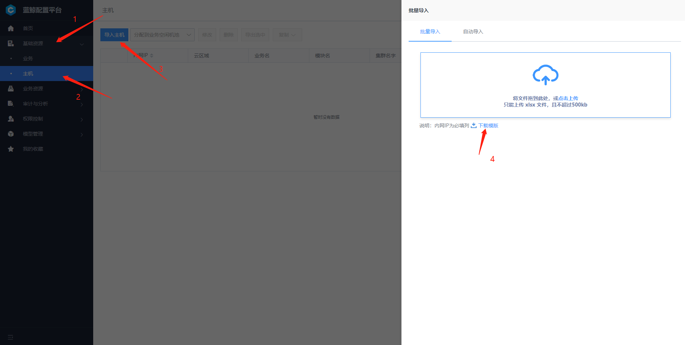

填写这4列保存；
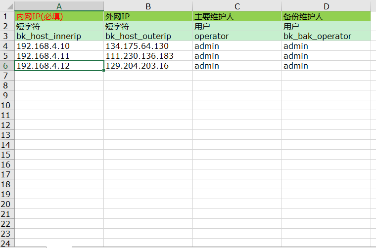

到配置平台-->基础资源-->主机-->导入主机-->批量导入-->点击上传刚才的表格，之后就能在资源池看到相关主机了；
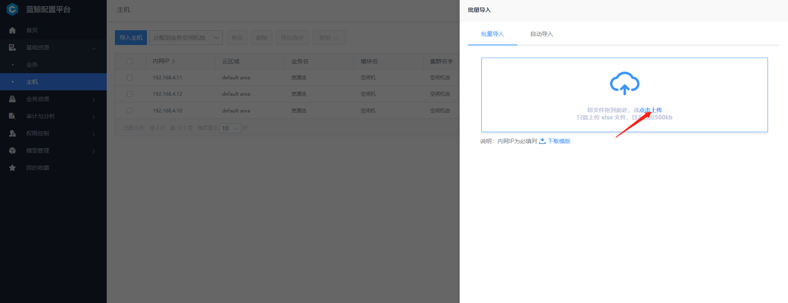

我们把主机分配到刚才创建的业务；点击基础资源-->主机-->选中所有主机-->分配到蓝鲸2；
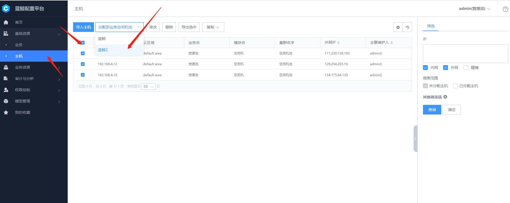

我们到业务资源-->业务拓扑-->蓝鲸2就能看到三台主机，我们把他转移到相关模块下；
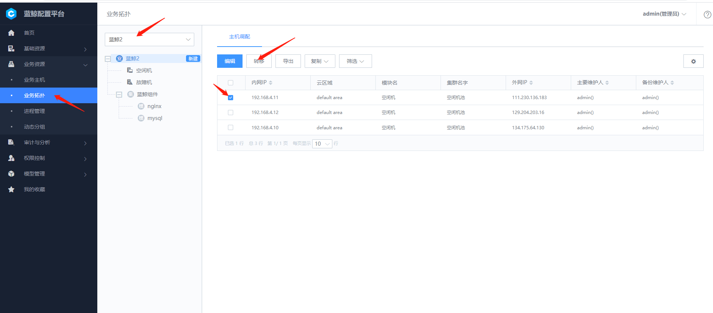
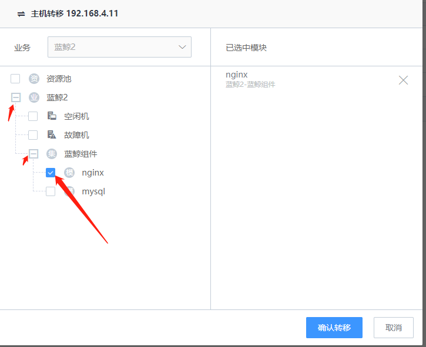
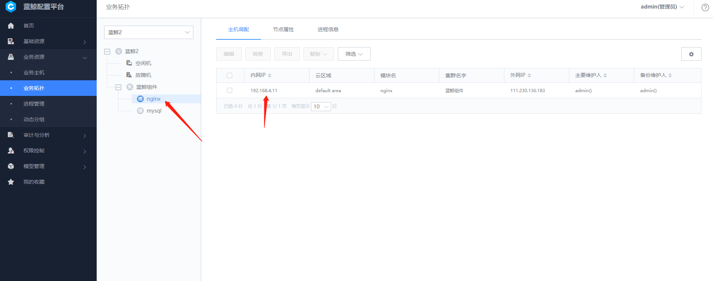
现在我们在nginx模块下就能看到该对应主机了，可以继续重复此操作给mysql模块也分配一台主机；
