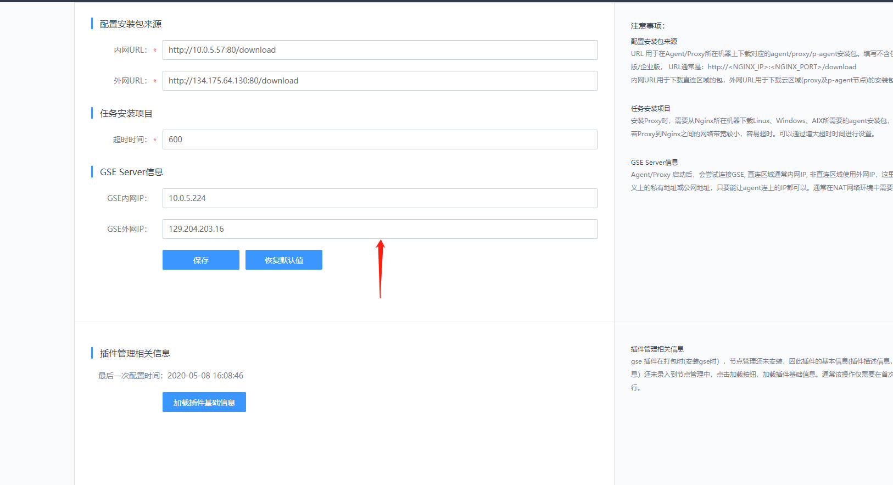

## 节点管理的使用

节点管理是蓝鲸各个平台和主机进行交互的一个关键，如配置不当，会导致在蓝鲸对主机操作的时候会出错，比如ssh无法连接到主机去执行任务。

下面来配置一下直连节点管理：

 

填写好相关信息后点击保存，然后点击加载插件基础信息；
 

然后添加节点，点击Agent管理-->导入主机-->从CMDB导入-->点击蓝鲸（业务）-->选中主机-->导入主机-->选择确认
 
 

点击Agent管理-->等待安装成功；

下面来更新一下官方包，操作如下：
点击插件管理-->选择所有机器-->下一步-->插件更新-->选择processbeat-->选择新包后面栏目里-->选择包-->立即执行；然后重复此操作选择basereport在执行一次；

等待这一步执行结束成功：

手动停止插件进程：
点击插件管理-->选择所有机器-->下一步-->进程管理-->停止-->processbeat-->立即执行；
然后重复一遍，将其启动;
也可以在中控机执行命令/usr/local/gse/plugins/bin/stop.sh processbeat 结束进程
/usr/local/gse/plugins/bin/start.sh processbeat 启动进程

在节点管理-->任务列表可以看到历史的执行记录以及日志；

